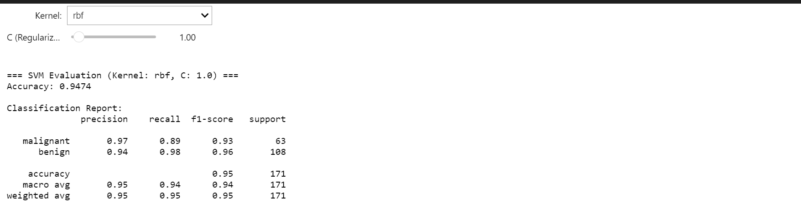
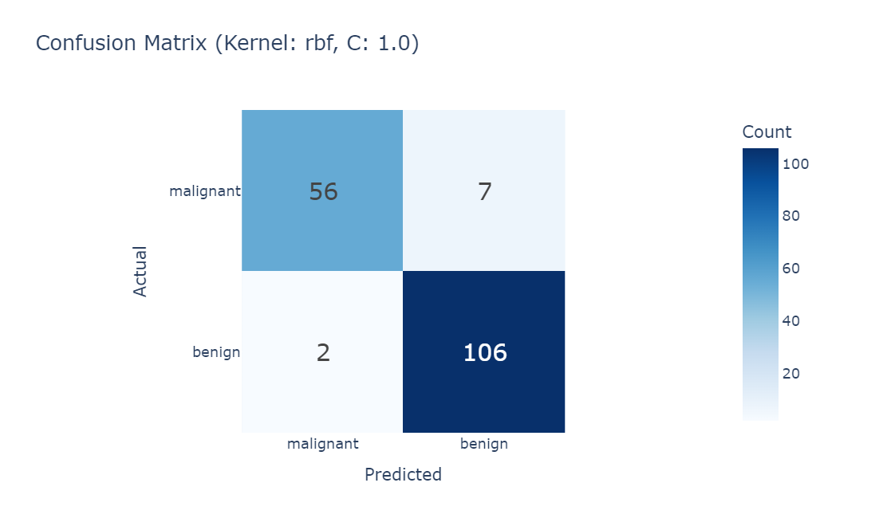
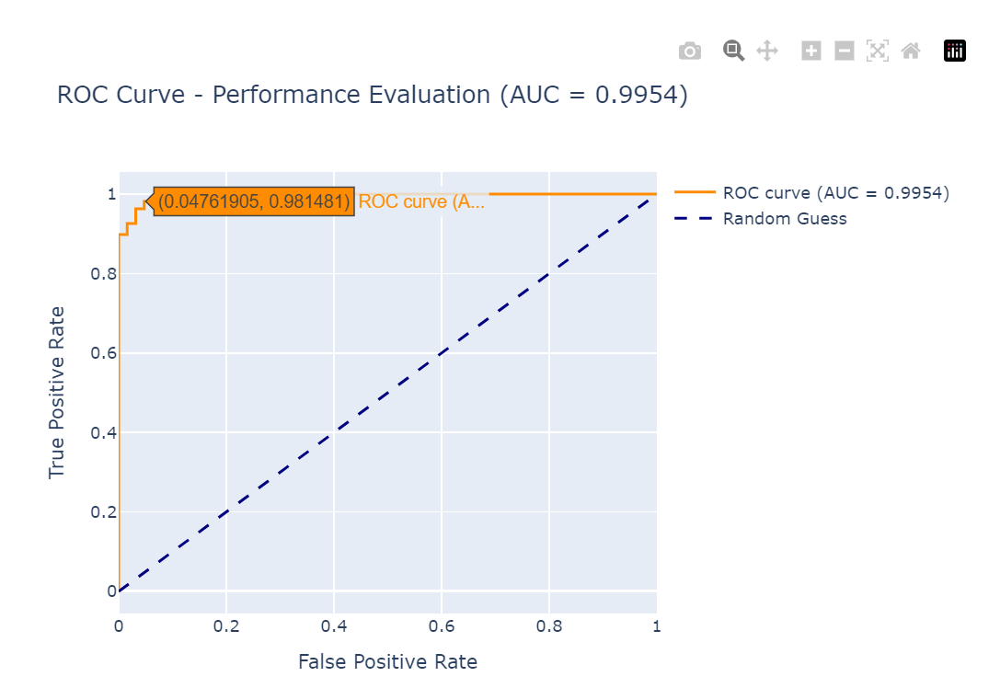
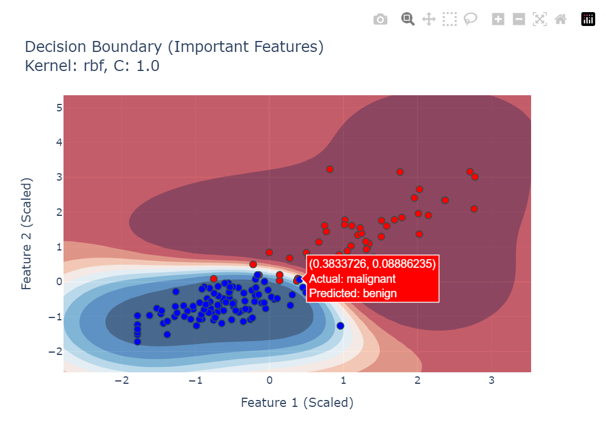
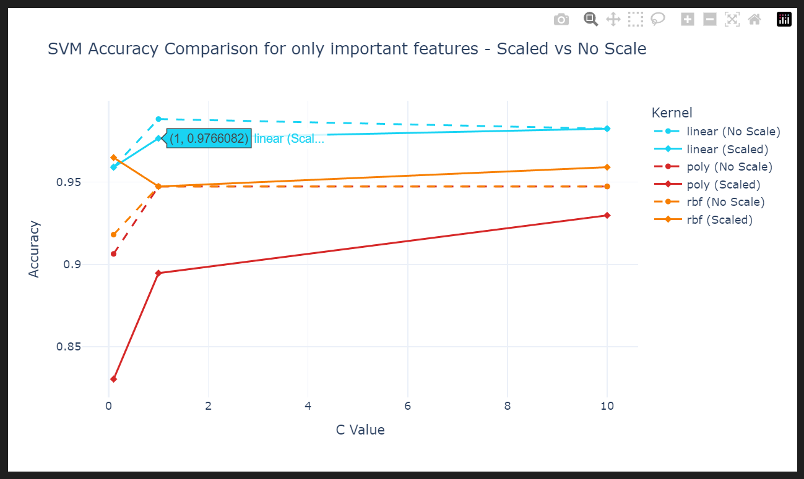

#🔬 **Breast Cancer Classification with Neural Networks**

---

## 🧠 Overview

An interactive machine learning project developed in a **Jupyter Notebook**, using:

- **Pandas** for data manipulation  
- **Scikit-learn** (MLPClassifier) for neural network modeling  
- **Matplotlib/Seaborn** for visualization

🎯 The goal is to classify breast cancer tumors as **malignant** or **benign** using Neural Networks and analyze performance across different architectures.

---

## 🚀 Features

### 📥 Data Acquisition & Preprocessing
- Loads the **Breast Cancer Wisconsin (Diagnostic)** dataset
- Applies `StandardScaler` for robust feature scaling

### 🧠 Neural Network Modeling
- Implements **Multi-layer Perceptron (MLPClassifier)**  
- Tests various hidden layer configurations & learning rates  
- Tracks training and testing performance

### 📊 Model Evaluation
- Uses key metrics:
  - `accuracy_score`
  - `confusion_matrix`
  - `classification_report`

### 📈 Comparative Analysis
- Visualizes results to identify the best performing modelذ

---

## 📷 Preview

### Classification Report

### Confusion Matrix  

### ROC Curve   

### Decision Boundary  

### SVM Accuracy Comparison  

---

## ▶️ How to Run

- Make sure Python and Jupyter are installed on your system.

- Install dependencies 
  pip install -r requirements.txt

- Launch the notebook
  jupyter notebook Breast Cancer Classification.ipynb
